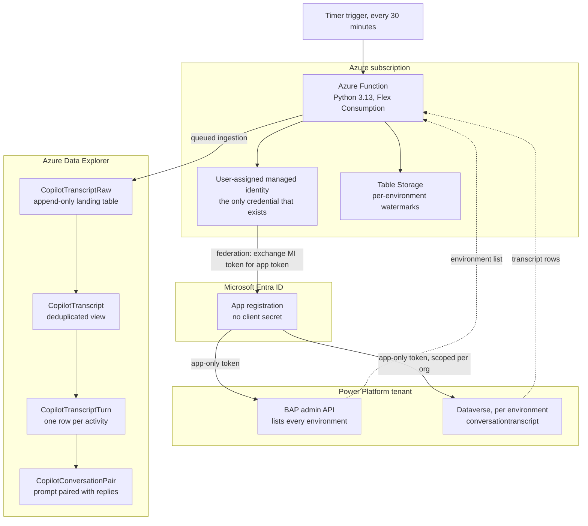
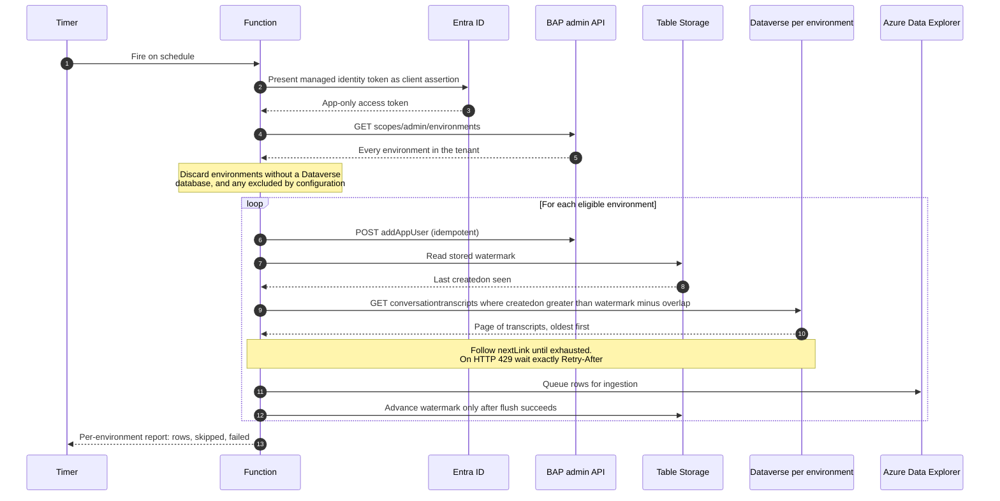
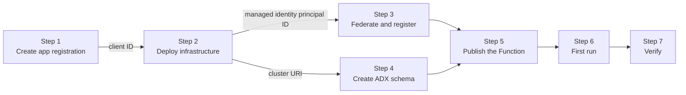

# Copilot Studio transcript sync

Collects Microsoft Copilot Studio conversation transcripts from **every Power Platform
environment in a tenant** and lands them in a single Azure Data Explorer database on a
schedule, with no secrets anywhere in the pipeline.

Dataverse bulk-deletes `conversationtranscript` rows after 30 days by default. This project
exists to build a durable, queryable archive that outlives that window, with transcripts from
every environment in one place — for custom analytics, security review, or retention that
exceeds what the source keeps.

---

## Contents

- [What it does](#what-it-does)
- [Architecture](#architecture)
- [How a sync run works](#how-a-sync-run-works)
- [Design decisions worth knowing](#design-decisions-worth-knowing)
- [Prerequisites](#prerequisites)
- [Implementation](#implementation)
- [Operating the pipeline](#operating-the-pipeline)
- [Querying the archive](#querying-the-archive)
- [Dashboard](#dashboard)
- [Configuration](#configuration)
- [Security posture](#security-posture)
- [Repository layout](#repository-layout)
- [Local development](#local-development)
- [Troubleshooting](#troubleshooting)
- [Teardown](#teardown)
- [Known gaps](#known-gaps)
- [Verification status](#verification-status)

---

## What it does

Every 30 minutes, a timer-triggered Azure Function:

1. **Discovers** every Power Platform environment in the tenant, app-only.
2. **Filters** out environments that cannot hold transcripts — Developer and Dataverse for
   Teams never persist them — and any without a Dataverse database.
3. **Provisions** a Dataverse application user in each eligible environment, so newly created
   environments are picked up without manual work.
4. **Extracts** `conversationtranscript` rows created since a per-environment high-water mark,
   honoring Dataverse service protection limits.
5. **Ingests** them into Azure Data Explorer, where a materialized view removes the duplicates
   that the deliberate overlap window produces.
6. **Projects** the raw Bot Framework activity log into turn-level rows and paired
   prompt/response rows.

A failure in one environment is isolated and reported; it never aborts the tenant-wide run.

---

## Architecture



<details>
<summary><strong>Architecture described as text</strong> (equivalent to the diagram above)</summary>

**Components and responsibilities**

| Component | Responsibility |
|---|---|
| Timer trigger | Fires the sync every 30 minutes |
| Azure Function (Python 3.13, Flex Consumption) | Orchestrates discovery, extraction, and ingestion |
| User-assigned managed identity | The only credential in the system; no secret exists anywhere |
| Entra app registration | Identity Power Platform requires; holds no credential of its own |
| Table Storage | Stores one `createdon` watermark per environment |
| BAP admin API | Lists every environment in the tenant |
| Dataverse Web API (per environment) | Serves `conversationtranscript` rows |
| Azure Data Explorer | Stores, deduplicates, and projects the archive |

**Trust relationships**

1. The Function authenticates to **Azure Data Explorer** and **Table Storage** directly as the
   managed identity.
2. The managed identity is **federated** onto the app registration. The Function requests a
   managed identity token with audience `api://AzureADTokenExchange` and presents it as a
   client assertion, receiving an app token in return. No client secret is involved.
3. Using that app token, the Function calls the **BAP admin API** app-only to list
   environments, and the **Dataverse Web API** of each environment to read transcripts.

**Data path inside Azure Data Explorer**

`CopilotTranscriptRaw` (append-only, contains overlap duplicates) → `CopilotTranscript`
(materialized view keeping the latest row per `ConversationTranscriptId`) →
`CopilotTranscriptTurn()` (one row per Bot Framework activity) → `CopilotConversationPair()`
(each user prompt with the agent replies that followed it).

</details>

### Why an app registration exists at all

The Function would rather use only its managed identity. Power Platform requires the app
registration for two reasons:

- Tenant-wide environment listing only works for an app registered as a **Power Platform
  management application**, and that registration takes a client ID.
- Each environment's Dataverse **application user** is bound to a client ID.

The app registration therefore has no credentials of its own — it exists purely as an identity
that Power Platform will accept, and the managed identity federates onto it.

---

## How a sync run works



<details>
<summary><strong>Sync run described as text</strong> (equivalent to the diagram above)</summary>

**Ordered steps**

1. The timer fires the Function on its schedule.
2. The Function presents its managed identity token to Entra ID as a client assertion.
3. Entra ID returns an app-only access token for the app registration.
4. The Function calls the BAP admin environments endpoint.
5. BAP returns every environment in the tenant.
6. The Function discards environments that cannot hold transcripts: Developer, Dataverse for
   Teams, anything without a Dataverse database, and anything whose instance is not `Ready`.
7. For each remaining environment, in sequence:
   1. Ensure the Dataverse application user exists (`addAppUser`, safe to repeat).
   2. Read the stored watermark from Table Storage.
   3. Query Dataverse for transcripts created after the watermark minus the overlap window,
      ordered oldest first, following `@odata.nextLink` until exhausted. On HTTP 429, wait
      exactly the `Retry-After` duration.
   4. Queue the resulting rows for ingestion into Azure Data Explorer.
   5. Advance the watermark **only after** the rows have been flushed, so an ingestion failure
      cannot silently skip data.
8. The Function returns a per-environment report of rows read, environments skipped, and
   environments that failed with the reason.

**Failure handling:** a permission error or transport failure in one environment is recorded
against that environment and the run continues. Its watermark is not advanced, so the next run
retries the same window.

</details>

---

## Design decisions worth knowing

### Environment discovery uses the legacy BAP admin endpoint, on purpose

`GET https://api.bap.microsoft.com/providers/Microsoft.BusinessAppPlatform/scopes/admin/environments`
is currently the only documented endpoint that lists **all** environments in a tenant to an
**app-only** caller.

The newer `api.powerplatform.com` surface exposes only *List Environments **For User***, still
marked preview, and Microsoft states plainly that ["Power Platform API uses delegated
permissions only at this time"][pp-auth-v2]. Using it would mean storing an administrator's
refresh token and renewing it forever — exactly the pattern this design avoids.

Both endpoints carry pre-release banners. Neither is unambiguously GA for tenant-wide app-only
discovery. That is a real gap, not an oversight.

### Change tracking is deliberately not used

Dataverse offers `Prefer: odata.track-changes` with delta links. It is the wrong tool here:

| Problem | Consequence |
|---|---|
| Delta links **propagate deletes** | The 30-day Dataverse bulk-delete job would erase the archive this pipeline exists to build |
| `$filter`, `$orderby`, `$top`, `$expand` are [rejected][change-tracking] with the header | No way to bound or resume a run |
| Delta tokens expire after a default of 7 days | Any longer outage silently forces a full reseed |

Instead the job keeps a `createdon` high-water mark per environment, replays a configurable
overlap window on each run, and deduplicates in Azure Data Explorer. The same trap applies to
the Azure Synapse Link route Microsoft otherwise recommends — it mirrors deletes unless you
explicitly choose append-only mode.

### No environment type is excluded by default

The pipeline queries every environment that has a Dataverse database, regardless of type.

The costs are asymmetric. Querying an environment that holds no transcripts costs a single
request returning zero rows. Skipping one that does hold transcripts loses that data
permanently, once Dataverse's 30-day retention passes. Measured in the tenant this was built
against, Developer environments held more transcripts than Production environments did.

Use `EXCLUDED_ENVIRONMENT_TYPES` to opt out of a type only after confirming it holds nothing
in your own tenant:

```powershell
python scripts/probe_all_environments.py --days 90
```

That reports the actual transcript count per environment, including types you might otherwise
skip, and authenticates as you rather than depending on application users.

### Transcripts over 1 MB are split across rows

`content` is capped at 1,048,576 characters. Larger conversations become multiple Dataverse
rows sharing `Name` and `ConversationStartTime`, distinguished by `Metadata.BatchId`.
`CopilotConversationPair()` orders by `BatchId` before pairing, so a conversation split across
rows still reassembles correctly.

### `from.role` is numeric and inverted

In transcript content, `from.role` is **`0` for the agent and `1` for the user** — not the
`"user"`/`"bot"` strings the Bot Framework schema uses elsewhere. Getting this backwards does
not fail; it silently attributes every agent utterance to the customer.
`CopilotTranscriptTurn()` normalizes both forms into a `Speaker` column.

`timestamp` is epoch seconds (confirmed against live data), though ISO 8601 and epoch
milliseconds also occur depending on channel. All three are handled.

### `Content` has three encodings, and two of them fail silently

Real transcripts store `content` in at least three shapes:

1. a bare array of activities
2. `{"activities": [ ... ]}` — the common case in current schema versions
3. double-encoded `{"text": "<json string>"}`, activities nested as a JSON string

Microsoft documents the activity *fields* but never the top-level shape. Handling only one
form does not raise an error — it silently yields zero activities, which reads as an empty
conversation rather than a parsing bug. `CopilotTranscriptTurn()` accepts all three.

---

## Prerequisites

### Tenant and environment

1. **Environment types.** No type is skipped by default, because skipping one that does hold
   transcripts loses that data permanently. [Measure your own tenant](#no-environment-type-is-excluded-by-default)
   with `scripts/probe_all_environments.py` before excluding anything. An environment does
   need a Dataverse database, which the discovery step checks.

2. **Transcript saving must be on**, per environment: Power Platform admin center →
   **Manage → Environments → [env] → Settings → Product → Features → Copilot Studio agents** →
   *"Allow conversation transcripts and their associated metadata to be saved in Dataverse"*.

   To enable it in bulk, publish the **Accessing transcripts from conversations in Copilot
   Studio agents** environment group rule. Note that [environment groups only accept managed
   environments][env-groups], so this is not available in every tenant. Configuring the rule
   without selecting **Publish rules** enables nothing.

3. **Transcripts lag.** A transcript is written after 30 minutes of conversation inactivity
   (3 minutes after *End Conversation* on the Telephony channel). Expect up to ~30 minutes
   before a finished conversation appears in Dataverse.

### Permissions for setup

| Task | Role required |
|---|---|
| Create the app registration | Application Administrator, Application Developer, or Cloud Application Administrator |
| Create the federated identity credential | Same as above, or Application Owner |
| Register the management application | Power Platform Administrator or Global Administrator |
| Deploy the Azure resources | Contributor plus User Access Administrator (role assignments) on the resource group |

### Local tools

| Tool | Version used | Check |
|---|---|---|
| Azure CLI | 2.90+ | `az version` |
| Azure Functions Core Tools | 4.x | `func --version` |
| Python | 3.13 (matches the Flex Consumption runtime) | `python --version` |
| PowerShell | 7.x for the bootstrap scripts | `pwsh --version` |

---

## Implementation

Two options: one command, or the seven steps individually.

### Quick install

```powershell
python -m venv .venv
.\.venv\Scripts\python.exe -m pip install -r requirements.txt

az login          # as a Power Platform or Global Administrator
./scripts/install.ps1
```

`install.ps1` chains all seven steps, passes client IDs and principal IDs between
them, retries alternative Azure Data Explorer SKUs when a region has no capacity,
runs the first sync, and verifies the result. It takes 20-30 minutes, most of it
waiting for the cluster.

```powershell
./scripts/install.ps1 -ResourceGroup rg-transcripts -Location westus2
./scripts/install.ps1 -FromStep 5     # resume after fixing a failure
```

Removal is the mirror image, and cleans up the tenant-level objects that deleting
the resource group leaves behind:

```powershell
./scripts/uninstall.ps1 -WhatIf       # report, change nothing
./scripts/uninstall.ps1               # prompts for the resource group name
```

The script still needs an interactive administrator sign-in: a service principal
cannot register itself as a Power Platform management application, by design.

### The steps individually

Follow these to understand what the installer does, or when you want to run part
of it yourself. The bootstrap is circular by nature: the infrastructure needs the
app registration's client ID, and the federated credential needs the managed
identity's principal ID, which only exists after the infrastructure is deployed.



<details>
<summary><strong>Deployment order described as text</strong> (equivalent to the diagram above)</summary>

| Step | Action | Consumes | Produces |
|---|---|---|---|
| 1 | Create the Entra app registration | — | Application (client) ID |
| 2 | Deploy the Bicep template | Client ID from step 1 | Managed identity principal ID, cluster URIs, Function App name |
| 3 | Create the federated credential and register the management application | Client ID, principal ID from step 2 | Working app-only access to Power Platform |
| 4 | Apply the Azure Data Explorer schema | Cluster URI from step 2 | Tables, ingestion mapping, views |
| 5 | Publish the Function code | Function App name from step 2 | Running app with both triggers |
| 6 | Trigger the first run | Function key | Transcripts in the landing table |
| 7 | Verify | — | Confidence the pipeline works end to end |

</details>

### Step 1 — Create the app registration

```powershell
./scripts/01-create-app-registration.ps1
```

This creates a single-tenant app registration with **no client secret**, creates its service
principal, and ensures the Power Apps Service resource principal exists in the tenant (Entra
will not issue a token for a resource whose service principal is absent, and in many tenants
it has never been provisioned).

Record the **Application (client) ID** it prints.

### Step 2 — Deploy the infrastructure

```powershell
az group create --name rg-copilot-transcripts --location eastus

az deployment group create `
  --resource-group rg-copilot-transcripts `
  --name cts-deploy `
  --template-file infra/main.bicep `
  --parameters powerPlatformAppClientId=<client-id-from-step-1>
```

This provisions the managed identity, storage account (deployment container plus watermark
table), Log Analytics and Application Insights, the Azure Data Explorer cluster and database,
the Flex Consumption plan and Function App, and — by default — a virtual network with private
endpoints for blob, queue, and table.

Record these outputs:

| Output | Used by |
|---|---|
| `identityPrincipalId` | Step 3 (federated credential subject) |
| `adxClusterUri` | Step 4 |
| `functionAppName` | Steps 5 and 6 |

> **Do not pass `adxAdminPrincipalId` with your own object ID.** Azure Data Explorer already
> grants Admin to the identity that deploys the database, and adding it again fails the
> deployment with *"a PrincipalAssignment resource already exists with the same role and
> principal id"*. The parameter exists only to grant an **additional** principal.

Useful parameters:

| Parameter | Default | Notes |
|---|---|---|
| `enablePrivateNetworking` | `true` | Set `false` in an unconstrained subscription to skip the VNet and private endpoints |
| `adxSkuName` | `Dev(No SLA)_Standard_E2a_v4` | Cheapest tier, no SLA. Use a Standard SKU for production |
| `adxSoftDeletePeriod` | `P730D` | Must exceed the 30-day Dataverse retention this pipeline outlives |
| `syncSchedule` | `0 */30 * * * *` | Timer NCRONTAB |

> **If the deployment fails with `InsufficientResourcesForSubscription`**, the region has no
> capacity for that Azure Data Explorer SKU right now. It is a transient shortage, not a quota
> or a template problem, and retrying the same SKU often fails again. Use a different one:
>
> ```powershell
> az deployment group create `
>   --resource-group rg-copilot-transcripts `
>   --template-file infra/main.bicep `
>   --parameters powerPlatformAppClientId=<client-id> `
>                adxSkuName='Dev(No SLA)_Standard_D11_v2'
> ```
>
> List what your subscription can actually place in a region before guessing:
>
> ```powershell
> $sub = az account show --query id -o tsv
> $t = az account get-access-token --resource https://management.azure.com/ --query accessToken -o tsv
> (Invoke-RestMethod -Headers @{Authorization = "Bearer $t"} `
>   -Uri "https://management.azure.com/subscriptions/$sub/providers/Microsoft.Kusto/skus?api-version=2024-04-13").value |
>   Where-Object { $_.resourceType -eq 'clusters' -and $_.locations -contains 'eastus' } |
>   ForEach-Object { $_.name } | Sort-Object -Unique
> ```
>
> A failed cluster rolls back cleanly and the template is idempotent, so re-running only
> creates what is missing.

### Step 3 — Federate the identity and register with Power Platform

```powershell
./scripts/02-federate-and-register.ps1 `
  -AppClientId <client-id-from-step-1> `
  -ManagedIdentityPrincipalId <identityPrincipalId-from-step-2>
```

This does two things:

1. Adds a **federated identity credential** to the app registration trusting the managed
   identity — issuer `https://login.microsoftonline.com/{tenantId}/v2.0`, subject the managed
   identity's object ID, audience `api://AzureADTokenExchange`.
2. Registers the app as a **Power Platform management application**, without which app-only
   calls to the BAP admin endpoint return 403.

> The federated credential's `subject` must be the managed identity's **Object (principal)
> ID**, not its client ID. Entra accepts a wrong value without error — the failure only
> appears later as a failed token exchange at runtime.

The script prefers the REST registration (`PUT .../adminApplications/{clientId}`), which
accepts an Azure CLI delegated token, and falls back to `New-PowerAppManagementApp` from the
`Microsoft.PowerApps.Administration.PowerShell` module only if that fails. Either way this
step needs a real administrator: a service principal cannot register itself, by design.

Verify:

```powershell
$t = az account get-access-token --resource "https://service.powerapps.com/" --query accessToken -o tsv
Invoke-RestMethod -Headers @{Authorization = "Bearer $t"} `
  -Uri "https://api.bap.microsoft.com/providers/Microsoft.BusinessAppPlatform/adminApplications?api-version=2020-10-01" |
  Select-Object -ExpandProperty value | Where-Object applicationId -eq "<client-id>"
```

### Step 4 — Create the Azure Data Explorer schema

```powershell
python scripts/deploy_kql.py `
  --cluster <adxClusterUri-from-step-2> `
  --database CopilotTranscripts
```

This applies `kql/01_tables.kql` then `kql/02_views.kql`: the landing table, its ingestion
mapping, retention and caching policies, the deduplicating materialized view, and the three
query functions. Add `--dry-run` to print the commands without executing them.

### Step 5 — Publish the Function

```powershell
func azure functionapp publish <functionAppName-from-step-2>
```

<details>
<summary><strong>If your subscription forces storage private</strong> — use a local build instead</summary>

The default publish performs a **remote build**, whose Kudu validation step fails when the
deployment storage account has `publicNetworkAccess = Disabled`:

```
[Kudu-ValidationStep] starting.
[StorageAccessibleCheck] ... 403 (This request is not authorized to perform this operation.)
InaccessibleStorageException: Failed to access storage account for deployment
```

Vendor the Linux dependencies yourself and publish without a remote build. This works — the
package upload itself succeeds against the private storage account, and Kudu confirms it with
`[Kudu-UploadPackageStep] completed. Uploaded package to storage successfully.` Only the
remote-build validation step fails:

```powershell
pip install `
  --target=".python_packages/lib/site-packages" `
  --platform manylinux2014_x86_64 `
  --only-binary=:all: `
  --python-version 3.13 `
  -r requirements.txt

func azure functionapp publish <functionAppName> --python --no-build
```

Two things worth knowing:

- **`--no-build` on its own deploys an app with zero functions.** It ships no dependencies, so
  the worker cannot import `azure.functions` and indexing silently yields nothing — while the
  publish still reports success. Populate `.python_packages` first.
- **Moving your build agent into the virtual network does not help.** Every first-party tool
  POSTs the package to the SCM `/api/publish` endpoint and the platform performs the storage
  write, so the client's network location is irrelevant to the leg that was failing.

Do not relax the policy to work around this, particularly when it is inherited from a
management group.

</details>

Confirm both triggers registered:

```powershell
az functionapp function list -g rg-copilot-transcripts -n <functionAppName> `
  --query "[].{name:name, trigger:config.bindings[0].type, schedule:config.bindings[0].schedule}" -o table
```

Expect `TranscriptSyncTimer` (timerTrigger) and `TranscriptSyncManual` (httpTrigger). An empty
list means the dependencies did not ship.

### Step 6 — Trigger the first run

```powershell
$key = az functionapp function keys list `
  -g rg-copilot-transcripts -n <functionAppName> `
  --function-name TranscriptSyncManual --query default -o tsv

Invoke-RestMethod -Method POST `
  -Uri "https://<functionAppName>.azurewebsites.net/api/sync?code=$key" `
  -TimeoutSec 900 | ConvertTo-Json -Depth 6
```

The response reports per-environment row counts and any environments that failed:

```json
{
  "environments_discovered": 12,
  "environments_synced": 2,
  "environments_failed": 0,
  "rows_ingested": 8,
  "environments": [
    { "environment_name": "Production", "environment_type": "Production",
      "rows": 6, "skipped": false, "error": null }
  ]
}
```

The first run backfills `INITIAL_BACKFILL_DAYS` (default 30) per environment — there is
nothing older than that left in Dataverse to pull.

### Step 7 — Verify

Allow about five minutes for Azure Data Explorer batching, then:

```kusto
// Rows arrived and parsed
CopilotTranscriptRaw
| summarize Transcripts = count(), ParseErrors = countif(isnotempty(ContentParseError))

// Per-environment coverage
CopilotTranscriptCoverage(30d)

// The projections work
CopilotTranscriptTurn() | summarize Turns = count() by Speaker, ActivityType
```

Then check for silent ingestion failures:

```kusto
.show ingestion failures | where FailedOn > ago(1h)
```

A second manual run returning **one row per active environment** rather than zero is correct —
that is the overlap window replaying the newest transcript, which the deduplicating view then
collapses.

---

## Operating the pipeline

### Schedule

The timer runs **every 30 minutes**, on the hour and half-hour (`0 */30 * * * *`, six NCRONTAB
fields: second, minute, hour, day, month, weekday).

That interval is deliberate: Dataverse only writes a transcript after 30 minutes of
conversation inactivity, so polling more often adds request pressure against the service
protection limits without improving freshness.

To change it without redeploying:

```powershell
az functionapp config appsettings set `
  -g rg-copilot-transcripts -n <functionAppName> `
  --settings SYNC_SCHEDULE="0 0 * * * *"

az functionapp restart -g rg-copilot-transcripts -n <functionAppName>
```

The restart matters — the timer binding reads its schedule when the host starts. There is also
a `syncSchedule` Bicep parameter if you would rather keep it in source.

The timer does **not** run on host startup (`run_on_startup=False`), so a restart or redeploy
waits for the next tick. Use the manual endpoint for an immediate run. Manual and timer runs
share the same watermarks, so triggering by hand does not duplicate work or disturb the
schedule.

### Monitoring

```kusto
// Which environments are still reporting, and when they were last seen
CopilotTranscriptCoverage(7d)

// Ingestion volume over time — gaps indicate missed runs
CopilotTranscriptRaw
| summarize Rows = count() by bin(IngestedAt, 30m)
| order by IngestedAt desc

// Transcripts that failed to parse
CopilotTranscriptRaw
| where isnotempty(ContentParseError)
| project EnvironmentName, ConversationTranscriptId, ContentParseError
```

Function logs go to Application Insights. Per-environment outcomes are logged at
`Information`, throttling and transport retries at `Warning`, and environments that failed at
`Warning` with the reason.

An environment disappearing from `CopilotTranscriptCoverage` means one of: no agent traffic,
transcript saving turned off, or the application user losing access.

### Operating notes

> **Never run `.clear materialized-view CopilotTranscript data`.** Clearing empties the view
> and it does **not** backfill — afterwards the view only materializes ingestion that arrives
> later, so every historical transcript silently disappears from every query built on it.

The raw table is unaffected, so recovery is to drop the view and let `scripts/deploy_kql.py`
recreate it with `backfill=true`:

```powershell
# .drop materialized-view CopilotTranscript
python scripts/deploy_kql.py --cluster <uri> --database CopilotTranscripts
```

Deleting rows from `CopilotTranscriptRaw` does not remove them from `CopilotTranscript` until
the view is rebuilt, for the same reason.

---

## Querying the archive

For ready-to-run reports, start with the [KQL report pack](reports/README.md):
daily usage, departmental adoption, agent performance, repeat usage, published
agents with no observed usage, and data-quality coverage. Each file is a
standalone, read-only query with an adjustable time window.

```kusto
// Recent conversations, prompt paired with response
CopilotConversationPair()
| where ConversationStartTime > ago(1d)
| project ConversationStartTime, EnvironmentName, BotName, UserPrompt, AgentResponse, ResponseLatency
| order by ConversationStartTime desc

// Every activity in one conversation, in order, including traces
CopilotTranscriptTurn()
| where ConversationId == "<conversation-id>"
| order by BatchId asc, ActivityIndex asc
| project ActivityTimestamp, Speaker, ActivityType, ValueType, Text

// Busiest agents across the tenant
CopilotConversationPair()
| where ConversationStartTime > ago(30d)
| summarize Turns = count(), Conversations = dcount(ConversationId) by EnvironmentName, BotName
| order by Turns desc

// Search transcript text tenant-wide
CopilotTranscriptTurn()
| where ActivityType == "message" and Text contains "refund"
| project ConversationStartTime, EnvironmentName, BotName, Speaker, Text
```

| Object | Type | Use |
|---|---|---|
| `CopilotTranscriptRaw` | Table | Landing table. Contains overlap duplicates — prefer the view |
| `CopilotTranscript` | Materialized view | Deduplicated transcripts, one row per Dataverse record |
| `CopilotTranscriptTurn()` | Function | One row per Bot Framework activity |
| `CopilotConversationPair()` | Function | Each user prompt with the agent replies that followed |
| `CopilotTranscriptCoverage(timespan)` | Function | Per-environment reporting health |

### The analytics layer

Raw activities answer "what was said". Reporting needs "how is Copilot Studio
being used", which is a different grain. Three further KQL files build that on
top of the same archive, so nothing extra is stored twice.

`kql/03_sessions.kql` reshapes activities into one row per session — the unit
Copilot Studio itself bills and reports on:

| Object | Use |
|---|---|
| `CopilotSession()` | One row per session: outcome, turn count, duration, design-mode flag, resolved user |
| `CopilotAgentKpi(lookback, includeDesignMode)` | Sessions, engagement, resolution, escalation and abandon rates per agent |
| `CopilotDailyTrend(lookback, includeDesignMode)` | Daily session and user counts for trend visuals |
| `CopilotDesignModeSplit(lookback)` | Real traffic against test-pane traffic, per agent |

`kql/04_agents.kql` adds an agent dimension synced from the Dataverse `bot`
table, so reports can show display names, publish state and authentication
mode rather than schema names:

| Object | Use |
|---|---|
| `CopilotAgent()` | Deduplicated agent metadata, latest row per agent |
| `CopilotAgentInventory(lookback, includeDesignMode)` | Every agent joined to its usage, including agents with none |
| `CopilotUnusedAgents(lookback)` | Published agents with no sessions in the window |

`kql/05_users.kql` adds an Entra user dimension resolved through Microsoft
Graph, which is what makes departmental adoption reporting possible:

| Object | Use |
|---|---|
| `CopilotUser()` | Deduplicated user metadata, latest row per object ID |
| `CopilotSessionByUser(lookback, includeDesignMode)` | Sessions attributed to a named user |
| `CopilotAdoptionByDepartment(lookback)` | Adoption grouped by department |
| `CopilotAdoptionByJobTitle(lookback, minSessions)` | Adoption grouped by job title |
| `CopilotAttributionCoverage(lookback)` | What share of sessions can be attributed to a user at all |

Two properties of this data decide whether a report is honest, and both are
measured rather than assumed:

**Most sessions in a typical tenant are test-pane traffic.** Copilot Studio
records authoring-time conversations with `isDesignMode` set. In the tenant
this was built against, 28 of 33 sessions were design mode — 85%. Every
function above defaults `includeDesignMode` to `false` for that reason. Turn it
on deliberately, not by accident.

**Only authenticated channels attribute a session to a person.** `from.id` is
hashed and is not an Entra object ID. Attribution depends on
`from.aadObjectId`, which unauthenticated channels never send. Run
`CopilotAttributionCoverage()` before presenting any per-user or per-department
number, because those breakdowns only ever describe the attributable share.

User sync is therefore **off by default** (`SYNC_USERS`, see
[Configuration](#configuration)). It calls Microsoft Graph and stores display
name, job title, department and office for people who used an agent. Enable it
only where that is appropriate for your tenant, and grant the Graph permission
with `scripts/grant_graph_permission.ps1`.

---

## Dashboard

`dashboard/CopilotStudioAnalytics.json` is an Azure Data Explorer dashboard: 30
tiles across four pages — Overview, Agents, Adoption and Governance — every one
of them a query against the KQL semantic layer above. It carries no tenant data
and no cluster name, so it is safe to commit and to share.

### Import it

```powershell
python dashboard/build_dashboard.py `
    --cluster https://yourcluster.eastus.kusto.windows.net `
    --database CopilotTranscripts
```

Then in the [Azure Data Explorer web UI](https://dataexplorer.azure.com):
**Dashboards → New dashboard → Import dashboard from file**, pick the generated
JSON, and give it a name.

Passing `--cluster` bakes the connection in so the dashboard works on import.
Omit it and the file keeps a placeholder, which you point at your own cluster
under **Data sources** after importing.

Viewers need **Viewer** on the database. Nothing else is deployed and nothing
else is billed — the dashboard is a feature of the cluster you already have.

### What it shows

| Page | Answers |
|---|---|
| Overview | How much is Copilot Studio being used, by whom, through which channels, and is usage rising |
| Agents | Which agents carry the load, which escalate most, how long conversations run |
| Adoption | Which departments and job titles have adopted it, and what share of sessions can be attributed at all |
| Governance | Which agents exist, which are published, which are unused, and how much traffic is really just the test pane |

Two controls apply across every page:

- **Time range** — a standard dashboard time picker, default 30 days.
- **Include test pane** — off by default. Copilot Studio records authoring-time
  conversations as sessions, and in this tenant they were 85% of all traffic.
  Leave it off for adoption reporting; turn it on to investigate a specific
  agent's behavior.

The Governance page deliberately ignores the time range for its agent
inventory. An unused agent produces no sessions, so it cannot be found by
filtering sessions — which is exactly why that page exists.

Tiles that group by agent join the agent dimension to resolve a display name.
Transcript metadata carries the agent's *schema* name (`cr7d6_serviceNow`), and
only the Dataverse `bot` table knows it is called `Service Now`. The join is
`leftouter` and falls back to the schema name, so an agent that has since been
deleted — or every agent, if `SYNC_AGENTS` is off — still appears rather than
collapsing to a blank label.

### Why a dashboard and not a Power BI template

This started as a Power BI `.pbit`. That was abandoned, and the reasoning is
worth recording because it is a general lesson rather than a Power BI
complaint.

No supported Microsoft library writes a `.pbit`. Building one means
reverse-engineering an undocumented binary container, and five separate defects
turned up in the hand-written package before it was dropped — a truncated
`DataMashup` part, a missing byte order mark, a declared-but-absent part, a
`Version` value that silently deferred the parameters a user typed, and missing
per-formula metadata that made Power BI try to load parameters as data tables.
Each one failed the same way: no error, or *"it may be corrupted"*.

The dashboard format is the opposite in every respect that matters:

| | `.pbit` | ADX dashboard |
|---|---|---|
| Format | Undocumented binary container | [Documented JSON](https://learn.microsoft.com/en-us/azure/data-explorer/azure-data-explorer-dashboards#export-dashboards) |
| Schema | None published | [Published and machine-readable](https://dataexplorer.azure.com/static/d/schema/20/dashboard.json) |
| Validation before shipping | Not possible | `build_dashboard.py` validates every build |
| Query verification | Not possible offline | `verify_queries.py` runs all 30 tiles |
| Extra infrastructure | Power BI Desktop, then a workspace | None |

Both generators can be checked before anyone opens the result:

```powershell
python dashboard/build_dashboard.py          # fails the build on a schema violation
python dashboard/verify_queries.py --cluster https://yourcluster.eastus.kusto.windows.net
```

The second one matters more than it looks. Schema validation proves the file is
well formed; it says nothing about whether the KQL works. `verify_queries.py`
substitutes the dashboard parameters and executes every tile, so a broken query
is caught in the terminal rather than by someone staring at an empty tile.

If you do want Power BI on top of this, the supported path is to build it in
Power BI Desktop against the same KQL functions and export the template from
Power BI itself, rather than generating the package by hand.

---

## Configuration

| Setting | Default | Purpose |
|---|---|---|
| `SYNC_SCHEDULE` | `0 */30 * * * *` | Timer NCRONTAB. Tighter than 30 minutes adds request pressure without adding freshness |
| `INITIAL_BACKFILL_DAYS` | `30` | History pulled the first time an environment is seen. Beyond ~30 days there is nothing left in Dataverse |
| `WATERMARK_LOOKBACK_MINUTES` | `120` | Overlap replayed before the stored watermark. Duplicates are removed by the view |
| `DATAVERSE_PAGE_SIZE` | `25` | `odata.maxpagesize`. Each row can carry 1 MB, so large pages mean very large responses |
| `AUTO_PROVISION_APP_USER` | `true` | Whether to call `addAppUser` for newly discovered environments |
| `EXCLUDED_ENVIRONMENT_TYPES` | *(empty)* | Environment SKUs to skip, comma separated. Empty by default, because skipping a type that does hold transcripts loses that data permanently. Measure before setting it |
| `SYNC_AGENTS` | `true` | Sync the Dataverse `bot` table into the agent dimension. Cheap, and needed for display names |
| `SYNC_USERS` | `false` | Resolve Entra users through Microsoft Graph into the user dimension. Off by default because it stores personal attributes. See [The analytics layer](#the-analytics-layer) |
| `PP_TENANT_ID` | — | Tenant hosting the Power Platform environments |
| `PP_APP_CLIENT_ID` | — | App registration from step 1 |
| `UAMI_CLIENT_ID` | — | Managed identity client ID. Leave blank locally to fall back to `az login` |

Throttling follows Microsoft's [service protection limits][api-limits] — 6,000 requests and 20
minutes of execution per user per web server in a five-minute sliding window. HTTP 429
responses honor `Retry-After` exactly, because ignoring it causes the penalty window to be
extended.

---

## Security posture

The Function's own footprint is minimal: a managed identity with **Ingestor** on one Azure
Data Explorer database, data-plane roles on one storage account, and **no secrets anywhere** —
no client secret, no connection string, no shared key. The storage account is deployed with
`allowSharedKeyAccess: false`.

**The Dataverse side is the weak point, and it is a deliberate tradeoff.** The `addAppUser`
endpoint that provisions application users across environments [always grants **System
Administrator**][add-app-user] and offers no way to choose a role. That is what makes new
environments self-healing — and it is far more privilege than reading two tables requires. The
job only ever issues `GET` requests against `conversationtranscript`.

To tighten this, set `AUTO_PROVISION_APP_USER=false` and provision application users yourself
with a custom role granting Read at Organization scope on `bot` and `conversationtranscript`
only:

```powershell
pac admin assign-user `
  --environment <environment-id> `
  --user <app-client-id> `
  --role "Copilot Transcript Reader" `
  --application-user
```

The custom role must already exist in each environment; ship it in a small solution.

**Transcripts contain conversation content, which routinely includes personal data.** Treat
the Azure Data Explorer database as a sensitive data store: restrict Viewer, and set retention
to match your actual obligation rather than leaving the 730-day default.

---

## Repository layout

```
copilot-transcript-sync/
├── function_app.py                     Azure Functions entry points (timer + HTTP)
├── host.json                           Functions host configuration
├── requirements.txt                    Pinned runtime dependencies
├── requirements-dev.txt                Test dependencies
├── local.settings.json.example         Template for local configuration
│
├── src/copilot_transcript_sync/
│   ├── settings.py                     Configuration from application settings
│   ├── credentials.py                  Managed identity and workload identity federation
│   ├── http.py                         Bearer tokens, 429/Retry-After handling
│   ├── powerplatform.py                BAP discovery and application user provisioning
│   ├── dataverse.py                    conversationtranscript extraction
│   ├── agents.py                       bot table extraction for the agent dimension
│   ├── users.py                        Microsoft Graph lookup for the user dimension
│   ├── watermarks.py                   Per-environment watermarks in Table Storage
│   ├── adx.py                          Queued ingestion into Azure Data Explorer
│   └── sync.py                         Orchestration and per-environment isolation
│
├── infra/main.bicep                    All Azure resources, RBAC, private networking
│
├── kql/
│   ├── 01_tables.kql                   Landing table, ingestion mapping, policies
│   ├── 02_views.kql                    Dedup materialized view and query functions
│   ├── 03_sessions.kql                 Session facts and agent KPIs
│   ├── 04_agents.kql                   Agent dimension and inventory
│   └── 05_users.kql                    Entra user dimension and adoption
│
├── dashboard/
│   ├── build_dashboard.py              Generates the ADX dashboard, schema-validated
│   ├── verify_queries.py               Runs every tile against a live cluster
│   └── CopilotStudioAnalytics.json     Importable dashboard, no tenant data
│
├── reports/                           Standalone, read-only KQL reports and usage guide
│
├── scripts/
│   ├── install.ps1                     One-command install, chains all seven steps
│   ├── uninstall.ps1                   One-command removal, including tenant objects
│   ├── 01-create-app-registration.ps1  Bootstrap phase 1
│   ├── 02-federate-and-register.ps1    Bootstrap phase 2
│   ├── grant_graph_permission.ps1      Grants User.Read.All to the managed identity
│   ├── deploy_kql.py                   Applies the KQL schema
│   ├── verify_install.py               Post-install health check, non-zero on failure
│   ├── probe_all_environments.py       Measures transcript counts per environment
│   ├── probe_table_schema.py           Dumps a Dataverse table's real column set
│   ├── smoke_discovery.py              Live tenant environment listing
│   ├── smoke_extract.py                Live extraction and ingestion
│   ├── smoke_pairing.py                Pairing check with synthetic data
│   ├── cleanup_smoke_data.py           Removes synthetic test data
│   └── cleanup_app_users.py            Removes Dataverse application users tenant-wide
│
└── tests/                              pytest suite, no Azure required
```

---

## Local development

```powershell
python -m venv .venv
.\.venv\Scripts\python.exe -m pip install -r requirements.txt -r requirements-dev.txt
.\.venv\Scripts\python.exe -m pytest tests -q

Copy-Item local.settings.json.example local.settings.json   # then fill in values
func start
```

Leaving `UAMI_CLIENT_ID` blank locally makes the code fall back to `DefaultAzureCredential`, so
you authenticate as yourself via `az login`. That exercises discovery and extraction, but
**not** the application-user path — a local run behaves as your user account, not as the app.

> **Watch out:** if `AZURE_CLIENT_ID` and `AZURE_CLIENT_SECRET` are set in your shell,
> `DefaultAzureCredential` resolves `EnvironmentCredential` *before* your `az login` session
> and silently authenticates as that service principal instead. `scripts/deploy_kql.py`
> therefore defaults to `AzureCliCredential`; pass `--credential default` to opt out.

### Smoke scripts

These talk to the real tenant and cluster, and are not part of `pytest`:

| Script | What it proves |
|---|---|
| `scripts/smoke_discovery.py` | Tenant-wide app-only environment listing, and the eligibility filter |
| `scripts/smoke_extract.py` | Dataverse extraction and ingestion across every eligible environment |
| `scripts/smoke_pairing.py` | `CopilotConversationPair()` against a synthetic conversation, cleaning up after itself |
| `scripts/cleanup_smoke_data.py` | Removes leftover synthetic rows |
| `scripts/cleanup_app_users.py` | Reports or removes the Dataverse application users across every environment |

---

## Troubleshooting

| Symptom | Cause | Fix |
|---|---|---|
| BAP listing returns **403** | App not registered as a Power Platform management application | Re-run step 3 |
| Token exchange fails at runtime | Federated credential subject is the managed identity's *client* ID instead of its *object* ID | Recreate the credential; Entra accepts the wrong value silently |
| One environment returns **401/403** | Application user missing or lacking Read on `conversationtranscript` | Check `AUTO_PROVISION_APP_USER`, or provision manually |
| An environment reports 0 transcripts | Transcript saving disabled, no agent traffic, or the type is in `EXCLUDED_ENVIRONMENT_TYPES` | Check the environment setting in the admin center, and run `scripts/probe_all_environments.py` |
| Publish fails at `StorageAccessibleCheck` | Remote build cannot use a private storage account | Use the local-build path in step 5 |
| Publish succeeds but **no functions listed** | `--no-build` shipped without dependencies | Populate `.python_packages` first |
| Deployment fails on a `PrincipalAssignment` | `adxAdminPrincipalId` duplicates the Admin that ADX grants the deployer | Omit the parameter |
| Deployment fails with `InsufficientResourcesForSubscription` | No regional capacity for that ADX SKU | Deploy a different `adxSkuName`, or a different region. See step 2 |
| Rows in `CopilotTranscriptRaw` but none in `CopilotTranscript` | The materialized view was cleared, or is still materializing | Drop the view and re-run `deploy_kql.py` |
| `CopilotConversationPair()` returns nothing | The transcripts are greeting-only sessions with no user-typed messages | Check `CopilotTranscriptTurn()` for `Speaker == "user"` and `ActivityType == "message"` |
| Repeated TLS resets against Dataverse | Transient, or an environment-level IP firewall | Retries and per-environment isolation handle it; check the run report |
| Every ADX call fails as an opaque network error | The cluster is stopped. A stopped cluster does not restart on a query | `az kusto cluster start`. The Bicep sets `enableAutoStop: false`, but a subscription cost automation can still stop it |
| `HTTP transport has already been closed` mid-run | The Kusto SDK closes any credential handed to it, so a shared instance breaks later consumers | Each consumer builds its own credential; do not reintroduce a cached one |
| User dimension stays empty with `SYNC_USERS=true` | `User.Read.All` not granted to the managed identity | Run `scripts/grant_graph_permission.ps1`. `az ad app permission` does not work for managed identities |
| Dashboard imports but every tile is empty | The data source still points at the placeholder cluster | Rebuild with `--cluster`, or set the cluster under **Data sources** in the dashboard |
| A single dashboard tile shows an error | The KQL function it calls is missing or was changed | Re-run `scripts/deploy_kql.py`, then `python dashboard/verify_queries.py --cluster <uri>` to see which tile and why |
| Dashboard shows far more sessions than expected | **Include test pane** is on, so authoring-time conversations are counted | Switch it back to *Real traffic only* |
| Agents appear under a schema name like `cr7d6_serviceNow` instead of their display name | Transcript metadata carries the schema name; the display name only exists in the Dataverse `bot` table | Confirm `SYNC_AGENTS` is on and the agent dimension has rows (`CopilotAgent() \| count`). Anything grouping by agent must join `CopilotAgent()` on `DataverseBotId == BotId` — the dashboard does this for you |

---

## Teardown

```powershell
./scripts/uninstall.ps1
```

That removes all four things, in the order that matters:

1. **Dataverse application users** in every environment. First, because it needs the app
   registration to still exist in order to enumerate environments and authenticate.
2. **The Power Platform management application** registration.
3. **The Entra app registration** and its service principal.
4. **The Azure resource group.**

Deleting the resource group alone leaves 1-3 behind: an app registration with tenant-wide
Power Platform rights, and a System Administrator application user in every environment.

```powershell
./scripts/uninstall.ps1 -WhatIf                    # report only
./scripts/uninstall.ps1 -Force                     # skip the confirmation prompt
./scripts/uninstall.ps1 -KeepResourceGroup         # tenant objects only
./scripts/uninstall.ps1 -AppClientId <id>          # when the registration is already gone
```

If step 1 fails the script **stops** rather than continuing, because deleting the app
registration would orphan those application users and make them much harder to find. To do
the steps by hand:

```powershell
python scripts/cleanup_app_users.py --client-id <client-id> --delete

$t = az account get-access-token --resource "https://service.powerapps.com/" --query accessToken -o tsv
Invoke-RestMethod -Method DELETE -Headers @{Authorization = "Bearer $t"} `
  -Uri "https://api.bap.microsoft.com/providers/Microsoft.BusinessAppPlatform/adminApplications/<client-id>?api-version=2020-10-01"

az ad app delete --id <client-id>
az group delete --name rg-copilot-transcripts --yes
```

> The admin center documents only a manual, per-environment removal of application users, and
> the Dataverse Web API has no documented recipe either. It does work: disable the `systemuser`
> record with `PATCH isdisabled=true`, then `DELETE` it. `scripts/cleanup_app_users.py` does
> this across the tenant, verified against 7 environments.
>
> The REST `DELETE` for the management application is undocumented but works and is verified
> here. The documented equivalent is `Remove-PowerAppManagementApp -ApplicationId <client-id>`.

---

## Known gaps

- Both documented environment-listing endpoints carry pre-release banners.
- `New-PowerAppManagementApp` cannot be run by a service principal for itself; the bootstrap
  genuinely requires an interactive administrator once. The REST equivalent
  (`PUT .../adminApplications/{clientId}`) accepts an Azure CLI delegated token, which
  `scripts/02-federate-and-register.ps1` uses to avoid the PowerShell module.
- Microsoft documents no end-to-end "managed identity → Dataverse Web API" flow. This project
  uses the documented workload identity federation path instead, which is GA.
- Whether change tracking is enabled by default on `conversationtranscript` is not documented.
  It does not matter here, since change tracking is not used.
- **Remote build fails when the deployment storage account is private.** A local build
  succeeds against the same account, so this is specific to the remote-build validation step
  rather than to storage access as such. Microsoft documents no supported end-to-end procedure
  for deploying Flex Consumption with `publicNetworkAccess = Disabled`, even though its own
  secured samples ship that topology.
- Environments are processed sequentially. `MAX_CONCURRENT_ENVIRONMENTS` exists in settings but
  is not yet used; a tenant with very many environments would benefit from parallelism bounded
  by the service protection limits.

---

## Verification status

Verified by a **complete teardown and clean reinstall**, run twice: once step by step, and
once as a single `install.ps1` from an empty resource group and a tenant with no prior app
registration.

| Step | Result |
|---|---|
| 1. Create app registration | Worked. Script's own next-step output contradicted this README and was corrected |
| 2. Deploy infrastructure | Template correct. Regional Azure Data Explorer capacity rejected the default SKU twice; the installer now retries alternatives automatically |
| 3. Federate and register | Worked first try |
| 4. Apply the KQL schema | Worked. `AzureCliCredential`'s 10-second default subprocess timeout later failed on a cold CLI; raised to 120s across every script |
| 5. Publish the Function | Worked via the documented local-build path; both triggers indexed |
| 6. First run | 12 environments discovered, 7 transcripts ingested, 0 failures |
| 7. Verify | 0 parse errors, 0 ingestion failures, coverage correct |
| `install.ps1` end to end | Completed, including automated verification |
| `uninstall.ps1 -WhatIf` | Reported all four phases accurately and changed nothing |
| `uninstall.ps1` | Removed all four, verified nothing left behind |

Behavior confirmed by the same run:

| Area | Result |
|---|---|
| Tenant-wide app-only environment discovery | 12 environments with Dataverse |
| Environment-type filtering | Configuration-driven; nothing excluded by default after Developer environments were measured holding transcripts |
| Developer environments | Queried like any other type; held 31 transcripts in this tenant |
| Workload identity federation at runtime | Function reached Power Platform with no secret |
| Application user auto-provisioning from scratch | Created in all 7 eligible environments for a brand-new client ID |
| ADX ingestion and JSON mapping | All rows landed, zero parse errors |
| `CopilotTranscript` dedup materialized view | Correct |
| `CopilotTranscriptTurn()` | Turns expanded; roles and epoch timestamps decoded correctly |
| `CopilotConversationPair()` | Verified with a synthetic conversation, including merging consecutive agent replies |
| Watermark persistence | Second run returned only the overlap window, proving the Table Storage round trip over a private endpoint |
| Overlap deduplication under repeated runs | 18 raw rows across three runs collapsed to 8 distinct transcripts |
| Timer trigger | Fired autonomously on schedule and ingested the overlap window |
| Agent dimension | 120 agents synced; join verified against `_bot_conversationtranscriptid_value`, not `metadata.BotId` |
| Entra user dimension | Resolved end to end through Microsoft Graph after granting `User.Read.All` to the managed identity |
| Session facts | 33 sessions built from raw activities; `CopilotDesignModeSplit()` correctly separated 28 test-pane from 5 real sessions |
| Dashboard | Validated against Microsoft's published JSON schema on every build. All 30 tiles executed against the live cluster and returned data |
| Teardown | Resource group, application users, management app registration, and app registration all removed and verified |
| Unit tests | 64 passing, no Azure required |

Transcript counts differ between installs (8 then 7) because Dataverse had bulk-deleted one
transcript past its 30-day retention in the interim — which is the reason this pipeline exists.

Not exercised: `enablePrivateNetworking=false`. Every deployment here ran under a policy that
forces storage private, so the simpler topology is reasoned about but untested.

The dashboard is verified as far as it can be without a human looking at it: the file matches
the published schema, and every tile query runs and returns data. Whether each visual is the
*right* visual for its data is a judgement call, not a test. With only 5 non-test-pane sessions
and 1 attributable user in this tenant, the Adoption page in particular will look sparse —
run `CopilotAttributionCoverage()` before reading anything into it.

### On the abandoned Power BI template

A hand-written `.pbit` generator was built first and then removed. Recorded here because the
failure mode generalizes beyond Power BI.

Five defects were found in the hand-written package, each one surfacing only after the previous
was fixed, and none of them producing a usable error message. Along the way three of the
conclusions reported during that work were wrong and had to be retracted:

| Claimed | Actually |
|---|---|
| "The model loaded successfully" | The check was reading stale Analysis Services workspaces left by earlier runs |
| "Reproduced the crash with no visuals, so the model is at fault" | The test harness sent a keystroke every 12 seconds that the control run never received; removing it removed the crashes |
| "Power BI is pegged at 97% CPU, so something is spinning" | Power BI Desktop idling with no document open uses ~64% of a core on this machine; CPU was never a signal |

The lesson that carried into the dashboard work: verify against an independent source that
cannot be fooled by the thing being tested. The cluster's own `.show queries` log settled every
question the desktop UI could not — whether a query ever arrived, whether it completed, and how
long it took. `dashboard/verify_queries.py` is the direct descendant of that.

---

## Diagram rendering

Diagrams use Mermaid with `accTitle` and `accDescr` accessibility metadata, and each is paired
with a visible text equivalent so the information is available without rendering the diagram.

They were verified against GitHub's own renderer, observed as **Mermaid v11.17.0 on
2026-09-04**. That renderer is platform-managed rather than pinned, so re-check after GitHub
updates, and confirm separately if you publish elsewhere.

> **If a diagram shows "Unable to render rich display — Cannot read properties of undefined
> (reading 'render')", reload the page.** That is a client-side race in GitHub's Mermaid
> loader, not invalid diagram source: `render()` is called before the module finishes loading.
> The first diagram on a page is the most exposed to it. Every diagram here renders
> consistently on repeated loads, and the text equivalent below each one carries the same
> information if it fails.

[pp-auth-v2]: https://learn.microsoft.com/en-us/power-platform/admin/programmability-authentication-v2
[change-tracking]: https://learn.microsoft.com/en-us/power-apps/developer/data-platform/use-change-tracking-synchronize-data-external-systems
[add-app-user]: https://learn.microsoft.com/en-us/power-platform/admin/create-dataverseapplicationuser
[api-limits]: https://learn.microsoft.com/en-us/power-apps/developer/data-platform/api-limits
[env-groups]: https://learn.microsoft.com/en-us/power-platform/admin/environment-groups
